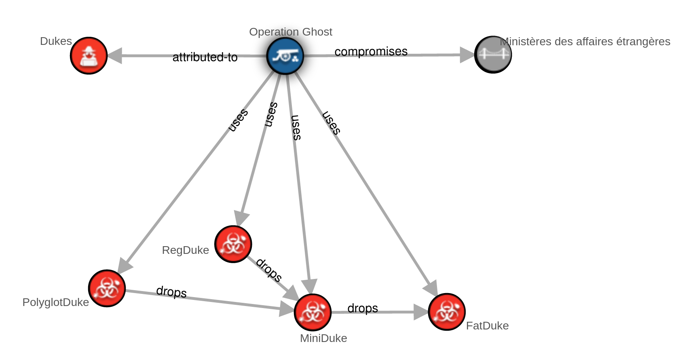
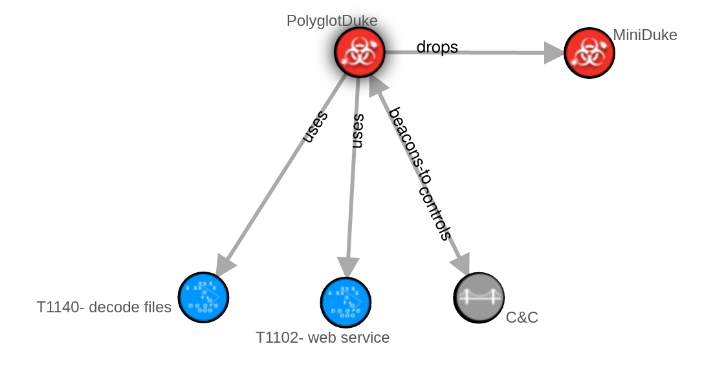
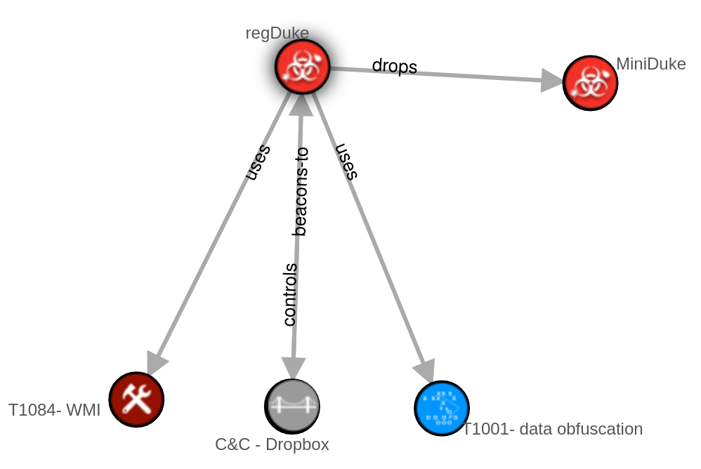

# Operation Ghost

Les schémas présentés dans ce document ont été réalisés à partir des fichiers JSON présents sur ce dépôt github et avec l’aide de la plateforme web suivante :

https://oasis-open.github.io/cti-stix-visualization/

Le groupe criminel des Dukes a mené une campagne d’espionnage surnommée opération Ghost sur plusieurs ministères des affaires étrangères de pays d’Europe entre 2013 et 2019. Cette campagne utilisent 4 logiciels malveillants. Après une phase initiale d’intrusion (via phishing ou autre), les Dukes utilisent PolyglotDuke pour installer la porte dérobée MiniDuke qui a son tour installe la porte dérobée plus puissante FatDuke qui permet une surveillance complète de la machine infectée. RegDuke est implanté dans la machine au début et n’est utilisé qu’en dernier recours en cas de perte de contrôle sur la machine.

Les schémas suivants donnent plus de détails sur le fonctionnement de PolyglotDuke et RegDuke :

Ainsi, le ‘dropper’ de PolyglotDuke commence par décoder avec un algorithme personnalisé un fichier GIF pour installer PolyglotDuke. Ensuite, le malware se connecte à un site public tel que Twitter ou Reddit et récupère l’URL chiffrée de son serveur de contrôle. Il communique ensuite avec son serveur C&C et récupère ses instructions à la fin de fichiers images valides.

RegDuke quant à lui utilise l’outil légitime Windows WMI pour établir sa persistance puis récupère régulièrement des images sur Dropbox (serveur C&C). L’image est valide et peu contenir des instructions en utilisant la technique de stéganographie Least Significant Bit consistant à cacher de l’information dans les bits de poids faibles.

PolyglotDuke et RegDuke finissent par installer MiniDuke. Cette porte dérobée communique via HTTP et dissimule ses messages en se rapprochant au maximum du trafic internet classique. Elle permet également à plusieurs machines infectées de communiquer entre elles via des pipes ou un proxy HTTP, ce qui facilite la communication avec le serveur C&C. MiniDuke finit par installer FatDuke, qui reprend essentiellement les mêmes techniques que MiniDuke avec des fonctionnalités plus avancée (plus de commandes possibles, meilleur obscurcissement du code, etc).

https://www.welivesecurity.com/wp-content/uploads/2019/10/ESET_Operation_Ghost_Dukes.pdf
